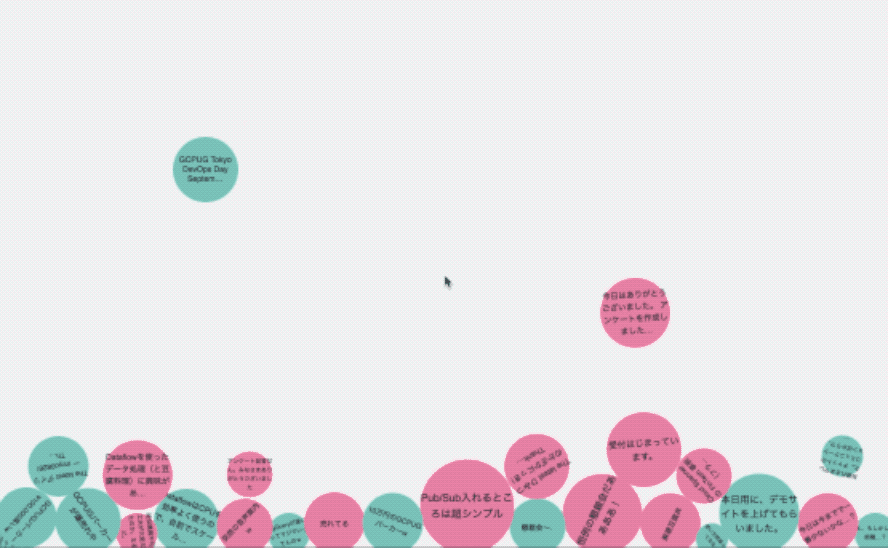

# nl-bubble

Cloud Natural Language API + Google App Engine + Firebase Demo WebApp.



## Prerequisites

- [Create Google Cloud Platform account](https://cloud.google.com/)
- [Create Firebase account](https://firebase.google.com/)
- [Enable Cloud Natural Language API](https://console.cloud.google.com/apis/library)

## Installation

[](https://console.cloud.google.com/cloudshell/open?git_repo=https://github.com/hayatoy/nl-bubble.git&page=editor)


### Install required libraries 

```bash
mkdir lib
pip install -t lib -r requirements.txt
```

### Make Dataset & Table in BigQuery

```bash
bq mk bubbles
bq mk bubbles.devfest2017 message:STRING,team:STRING,score:FLOAT,magnitude:FLOAT
```

### Deploy Application

```bash
gcloud app deploy .
```
